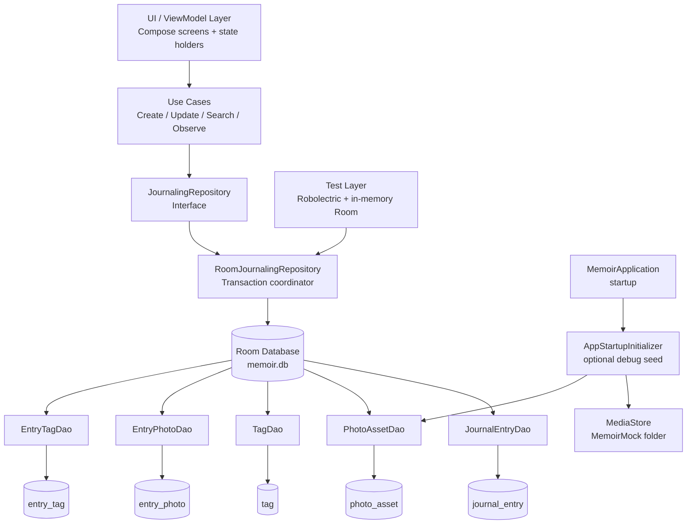

# Memoir

Memoir is a photo journaling app that helps you remember and share the photo-worthy moments of your life.

Using Memoir you can:
- Get daily reminders to review your photos.
- Annotate photos with descriptions and tags.
- Organize photos into folders and albums.
- Share albums.
- Search for images based on description, people in the image, tags, location, photographer.

See [the pitch](./docs/Pitch.md) for a more detailed description of Memoir and its usecases.

# The Team
- Andrew Willms (Andrew-Willms)
- Arni Nalawade (Arni-Nalawade)
- Brianna Gonzalez (gonzalezbrianna)
- Carter Demars (carterdemars)
- Nathan Xie (na3th9n)
- Ryan Gosal (RyanGosal24)

## 452 Housekeeping
- See [Team contract](./docs/team-contract.md) for our team contract and team rolls.
- See [Meeting minutes](./docs/meetings/) for a record of meeting minutes.

---

# Android Backend Architecture (Beginner Guide)

This section explains the architecture used in the Android app module at [Memoir/](./Memoir), assuming you are new to Android and Kotlin.

## Big picture: what architecture style is this?

The app uses a layered, **clean-ish architecture** with clear responsibilities:

1. **Data layer** (Room database, DAOs, repository implementation)
2. **Domain layer** (use-cases = app actions)
3. **App/startup wiring** (application bootstrapping and optional emulator seeding)

The goal is to keep business logic independent from UI so the code is easier to test, maintain, and extend.

## Core terms (simple definitions)

- **Entity**: A Kotlin data class that represents one table row in SQLite.
	- Example: [JournalEntryEntity.kt](./Memoir/app/src/main/java/nostalgia/memoir/data/local/entities/JournalEntryEntity.kt)
- **DAO (Data Access Object)**: An interface with SQL operations (`insert`, `update`, `query`) for one area of data.
	- Example: [JournalEntryDao.kt](./Memoir/app/src/main/java/nostalgia/memoir/data/local/dao/JournalEntryDao.kt)
- **Room Database**: Android’s SQLite abstraction that connects entities + DAOs into one DB object.
	- Example: [MemoirDatabase.kt](./Memoir/app/src/main/java/nostalgia/memoir/data/local/MemoirDatabase.kt)
- **Repository**: A boundary layer that exposes app-friendly operations and hides DB details.
	- Interface: [JournalingRepository.kt](./Memoir/app/src/main/java/nostalgia/memoir/data/repository/JournalingRepository.kt)
	- Implementation: [RoomJournalingRepository.kt](./Memoir/app/src/main/java/nostalgia/memoir/data/repository/RoomJournalingRepository.kt)
- **Use Case**: A single user action from the app’s perspective (create entry, update entry, search entries, etc.).
	- Folder: [domain/usecase](./Memoir/app/src/main/java/nostalgia/memoir/domain/usecase)
- **Flow**: Kotlin stream type for observing changing data over time (great for “live” screens).
	- Used in repository APIs such as `observeAllEntries()`.

## Data model design

The journaling schema is normalized for flexibility and correctness.

- `journal_entry`: entry text/date metadata
- `photo_asset`: photo references (`contentUri`) and lightweight metadata
- `entry_photo`: join table between entries and photos (many-to-many + display ordering)
- `tag`: semantic tags (`PERSON`, `PLACE`, `KEYWORD`, etc.)
- `entry_tag`: join table between entries and tags

Entities live in:
- [entities folder](./Memoir/app/src/main/java/nostalgia/memoir/data/local/entities)

Why this is best practice:
- Avoids duplicated data
- Supports advanced queries later
- Keeps relationships explicit and easy to reason about

## Why this follows Android best practices

### 1) Room + DAO abstraction

Room provides compile-time SQL validation and safer schema handling.

- DB definition: [MemoirDatabase.kt](./Memoir/app/src/main/java/nostalgia/memoir/data/local/MemoirDatabase.kt)
- DAO contracts: [dao folder](./Memoir/app/src/main/java/nostalgia/memoir/data/local/dao)

### 2) Transactional writes for consistency

`RoomJournalingRepository` wraps aggregate writes in `database.withTransaction { ... }`.

Example: `createEntryAggregate(...)` writes entry + photos + tags atomically.

- Code: [RoomJournalingRepository.kt](./Memoir/app/src/main/java/nostalgia/memoir/data/repository/RoomJournalingRepository.kt)

Why this matters:
- If one write fails, partial data isn’t left behind.
- Essential for offline-first apps.

### 3) Domain use-cases keep UI thin

UI should call use-cases, not run SQL logic.

- Use-case construction: [JournalingUseCaseFactory.kt](./Memoir/app/src/main/java/nostalgia/memoir/domain/usecase/JournalingUseCaseFactory.kt)
- Example actions:
	- [CreateEntryUseCase.kt](./Memoir/app/src/main/java/nostalgia/memoir/domain/usecase/CreateEntryUseCase.kt)
	- [UpdateEntryUseCase.kt](./Memoir/app/src/main/java/nostalgia/memoir/domain/usecase/UpdateEntryUseCase.kt)
	- [ObserveAllEntriesUseCase.kt](./Memoir/app/src/main/java/nostalgia/memoir/domain/usecase/ObserveAllEntriesUseCase.kt)

Why this matters:
- Easier testing
- Easier refactors
- Cleaner ViewModel/UI code later

### 4) Startup bootstrap is isolated

Startup logic is in a dedicated initializer, not mixed into activity UI.

- App entry point: [MemoirApplication.kt](./Memoir/app/src/main/java/nostalgia/memoir/MemoirApplication.kt)
- Startup importer: [AppStartupInitializer.kt](./Memoir/app/src/main/java/nostalgia/memoir/data/startup/AppStartupInitializer.kt)

Why this matters:
- Startup behavior is predictable and testable
- Easy to toggle debug seed behavior via build config

## How data flows through the app

Think of it like a restaurant:
- **Use-case** = waiter taking a request
- **Repository** = kitchen coordinator
- **DAO** = specialized chefs
- **Room DB** = pantry/storage

Example “Create Journal Entry” flow:

1. UI/ViewModel calls `CreateEntryUseCase`
2. Use-case calls `JournalingRepository.createEntryAggregate(...)`
3. `RoomJournalingRepository` starts one transaction
4. DAOs insert/update `journal_entry`, `photo_asset`, `entry_photo`, `tag`, `entry_tag`
5. Transaction commits -> data persists locally

Primary code path:
- [CreateEntryUseCase.kt](./Memoir/app/src/main/java/nostalgia/memoir/domain/usecase/CreateEntryUseCase.kt)
- [JournalingRepository.kt](./Memoir/app/src/main/java/nostalgia/memoir/data/repository/JournalingRepository.kt)
- [RoomJournalingRepository.kt](./Memoir/app/src/main/java/nostalgia/memoir/data/repository/RoomJournalingRepository.kt)

## Persistence behavior (what survives app restarts)

- Yes: Journal entries and related links persist because Room stores them in on-device SQLite (`memoir.db`).
- Startup seeding imports photo metadata if enabled in debug and if media permission is granted.
- Existing rows are **upserted by `contentUri`**, so startup import is idempotent.

## Testing strategy used

We use JVM unit tests with Robolectric + in-memory Room to verify backend behavior without requiring UI.

Test suite:
- [RoomJournalingRepositoryTest.kt](./Memoir/app/src/test/java/nostalgia/memoir/data/repository/RoomJournalingRepositoryTest.kt)

What it validates:
- aggregate create/update correctness
- search and date-range query behavior
- startup/open-style “observe all persisted entries” behavior

## What this architecture enables next

- Add ViewModels and screens without rewriting backend logic
- Add albums/sharing tables in the same layered pattern
- Add sync later by introducing remote data sources while keeping domain APIs stable

If you are new to Android: this setup is a strong baseline because it separates concerns early and makes future features much less risky.
